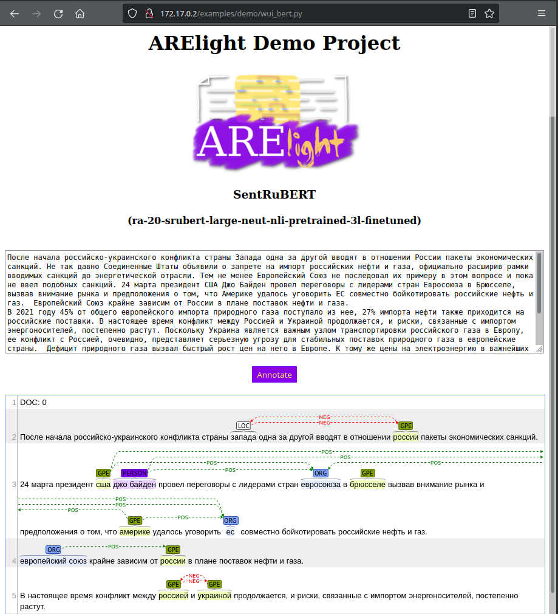
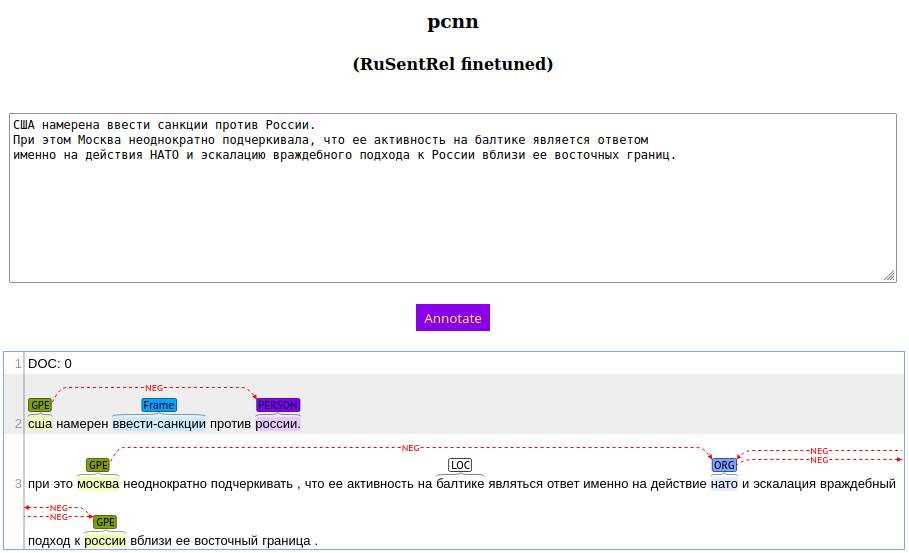

# ARElight 0.22.1


### :point_right: [DEMO](#docker-verion-quick) :point_left:

> **Supported Languages**: Russian

ARElight is an application for a granular view onto sentiments between mentioned named entities in a mass-media texts written in Russian.

This project is commonly powered by [AREkit](https://github.com/nicolay-r/AREkit) framework.

for Named Entity Recognition in text sentences, 
we adopt [DeepPavlov](https://github.com/deeppavlovteam/DeepPavlov)  (BertOntoNotes model).

<p align="center">
    
</p>


# Dependencies

* arekit == 0.22.1
* deeppavlov == 0.11.0
* rusenttokenize
* brat-v1.3 [[github]](https://github.com/nlplab/brat)
* CUDA


# Installation


## Docker verion (Quick)

> **Supported Languages**: Russian

> **Other Requirements**: NVidia-docker

* Download [nicolay-r-arelight-0.1.1.tar](https://drive.google.com/u/0/uc?id=1hd6EOcN5haEJM0dp_sdsNCX36lGG-y8Y&amp;export=download&amp;confirm=t)
* Import container and start Apache hosting: 
```bash
docker import nicolay-r-arelight-0.1.1.tar 
docker run --name arelight -itd --gpus all nicolay-r/arelight:0.1.1
docker attach arelight
service apache2 start
```
* Proceed with BERT demo: http://172.17.0.2/examples/demo/wui_bert.py

> **Supported Languages**: Russian



* PCNN example, finetuned on [RuSentRel](https://github.com/nicolay-r/RuSentRel):
http://172.17.0.2/examples/demo/wui_nn.py

> **Supported Languages**: Russian



## Full 
* ARElight:
```bash
# Install the required dependencies
pip install -r dependencies.txt
# Donwload Required Resources
python3.6 download.py
```

* BRAT: [Download](https://github.com/nlplab/brat/releases/tag/v1.3_Crunchy_Frog) 
  and install library, and run standalone server as follows:
```
./install.sh -u
python standalone.py
```

Usage: proceed with the `examples` folder.

# Inference

> **Supported Languages**: Russian

Infer sentiment attitudes from a mass-media document(s).

Using the `BERT` fine-tuned model version:
```bash
python3.6 infer_bert.py --from-files ../data/texts-inosmi-rus/e1.txt \
    --labels-count 3 \
    --terms-per-context 50 \
    --tokens-per-context 128 \
    --text-b-type nli_m \
    -o output/brat_inference_output
```
<p align="center">
    
</p>

> **Supported Languages**: Russian

Using the pretrained `PCNN` model (including frames annotation):
```bash
python3.6 infer_nn.py --from-files ../data/texts-inosmi-rus/e1.txt \
    --model-name pcnn \
    --model-state-dir models/ \
    --terms-per-context 50 \
    --stemmer mystem \
    --entities-parser bert-ontonotes \
    --frames ruattitudes-20 \
    --labels-count 3 \
    --bags-per-minibatch 2 \
    --model-input-type ctx \
    --entity-fmt hidden-simple-eng \
    --synonyms-filepath ../data/synonyms.txt \
    -o output/brat_inference_output
```

<p align="center">
    
</p>

# Serialization 

> **Supported Languages**: Any

For the `BERT` model:
```bash
python3.6 serialize_bert.py --from-files ../data/texts-inosmi-rus/e1.txt 
    --entities-parser bert-ontonotes \
    --terms-per-context 50 
```

<p align="center">
    
</p>

> **Supported Languages**: Russian by default (depends on embedding)

For the other neural networks (including embedding and other features):
```bash
python3.6 serialize_nn.py --from-files ../data/texts-inosmi-rus/e1.txt \
    --entities-parser bert-ontonotes \
    --stemmer mystem \
    --terms-per-context 50 \
    --synonyms-filepath ../data/synonyms.txt \
    --frames ruattitudes-20 
```

<p align="center">
    
</p>

# Papers

* [Nicolay Rusnachenko: Language Models Application in Sentiment Attitude Extraction Task (2021) [RUS]](https://nicolay-r.github.io/website/data/rusnachenko2021language.pdf)

# Powered by

* AREkit [[github]](https://github.com/nicolay-r/AREkit)

<p float="left">
<a href="https://github.com/nicolay-r/AREkit"></a>
</p>
